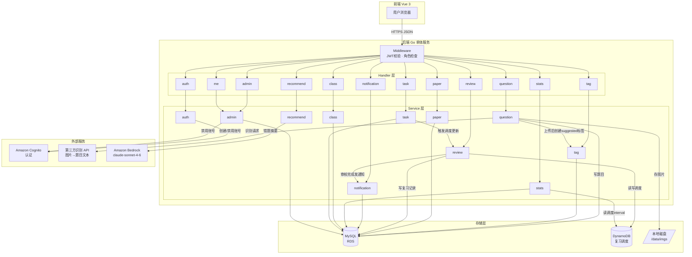
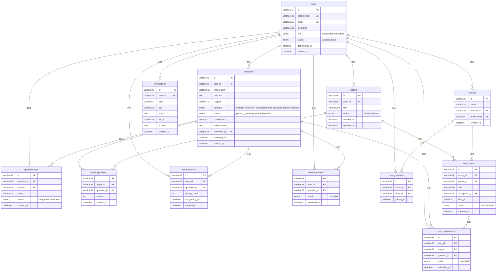
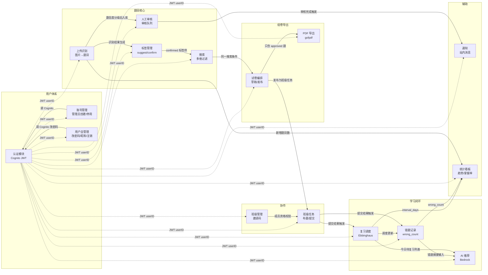
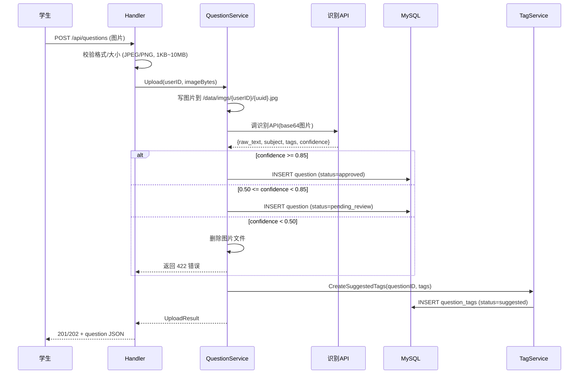
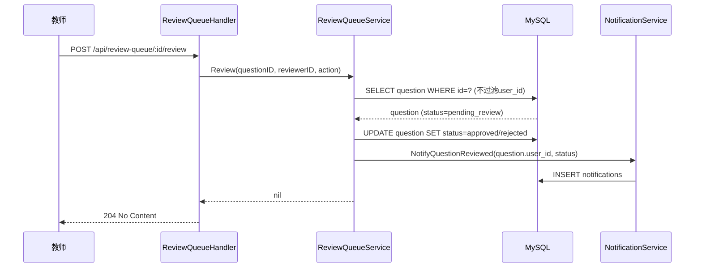
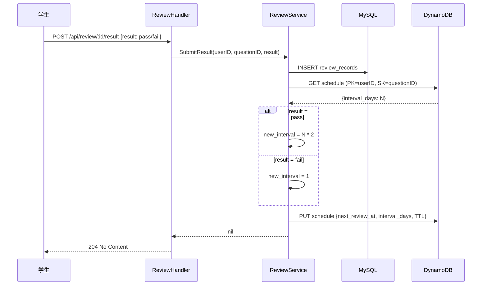
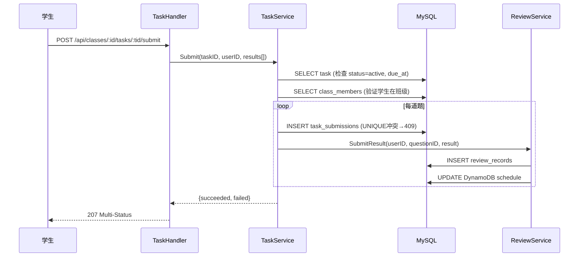

# 错题本 — 系统设计文档

**版本**: 1.0
**日期**: 2026-06-24
**技术栈**: Go 1.25 · GORM · MySQL · Vue 3 · AWS ECS Fargate

---

## 一、整体架构

```
[Vue 3 前端 · 静态文件托管]
          │  HTTPS / JSON API
  [Go 1.25 单体服务 · ECS Fargate · :8080]
          │
    ┌─────┼──────────────┐
    │     │              │
 [MySQL  [本地磁盘       [DynamoDB]
  RDS]   /data/imgs]    复习调度]

  [第三方识别 API]   [Amazon Bedrock claude-sonnet-4-6]
```

**关键决策：**
- Go 单体服务，Handler → Service → Repository 三层，无多余抽象
- GORM 作为 MySQL ORM，减少手写 SQL
- DynamoDB 仅用于复习调度（高频读写 + TTL），其余全部在 MySQL
- 图片存储到 ECS Task 挂载的本地卷，路径写入 MySQL
- 前端 Vue 3 + Vite，调用后端 JSON API，独立部署

---

## 二、目录结构

```
backend/
  main.go                  启动入口
  config/config.go         配置读取（环境变量）
  db/
    mysql.go               GORM 初始化
    dynamodb.go            DynamoDB 客户端
  model/                   GORM 模型（数据库表定义）
    user.go
    question.go
    tag.go
    paper.go
    notification.go
    error_record.go
    review.go
    class.go
    task.go
  handler/                 HTTP 处理器（路由入口）
    auth.go
    question.go
    tag.go
    paper.go
    review.go
    recommend.go
    notification.go
    stats.go
    admin.go
    me.go
    class.go
    task.go
  service/                 业务逻辑
    auth.go
    question.go
    tag.go
    paper.go
    review.go
    recommend.go
    notification.go
    stats.go
    admin.go
    class.go
    task.go
  middleware/
    auth.go                JWT 校验，注入 userID
    role.go                角色权限检查
  migrations/              SQL 迁移文件

frontend/
  src/
    views/                 页面组件
    components/            公共组件
    api/                   axios 封装
    router/                vue-router
    store/                 pinia 状态管理
```

---

## 三、数据模型

所有表使用 GORM AutoMigrate 或手动迁移文件管理。

### users
```go
type User struct {
    ID           string    `gorm:"primaryKey;type:varchar(36)"`
    CognitoSub   string    `gorm:"uniqueIndex;type:varchar(128)"`
    Email        string    `gorm:"uniqueIndex;type:varchar(255)"`
    Nickname     string    `gorm:"type:varchar(100)"`
    Role         string    `gorm:"type:enum('student','teacher','admin');default:'student'"`
    Status       string    `gorm:"type:enum('active','inactive');default:'active'"`
    DeactivatedAt *time.Time
    CreatedAt    time.Time
}
```

### questions
```go
type Question struct {
    ID           string    `gorm:"primaryKey;type:varchar(36)"`
    UserID       string    `gorm:"index;type:varchar(36)"`
    ImagePath    string    `gorm:"type:varchar(500)"`
    RawText      string    `gorm:"type:text"`
    Subject      string    `gorm:"type:varchar(100)"`
    Category     string    `gorm:"type:enum('multiple_choice','fill_blank','essay','true_false','calculation','unknown');default:'unknown'"`
    Status       string    `gorm:"type:enum('pending_review','approved','rejected');default:'pending_review'"`
    Confidence   float64
    ReviewNote   string    `gorm:"type:text"`
    ReviewedBy   string    `gorm:"type:varchar(36)"`
    ReviewedAt   *time.Time
    CreatedAt    time.Time
}
```

### question_tags
```go
type QuestionTag struct {
    ID         string    `gorm:"primaryKey;type:varchar(36)"`
    QuestionID string    `gorm:"index;type:varchar(36)"`
    UserID     string    `gorm:"type:varchar(36)"`
    Name       string    `gorm:"type:varchar(100)"`
    Status     string    `gorm:"type:enum('suggested','confirmed');default:'suggested'"`
    CreatedAt  time.Time
}
// 唯一约束：(question_id, name)
```

### papers
```go
type Paper struct {
    ID        string    `gorm:"primaryKey;type:varchar(36)"`
    UserID    string    `gorm:"index;type:varchar(36)"`
    Title     string    `gorm:"type:varchar(200)"`
    Status    string    `gorm:"type:enum('draft','published');default:'draft'"`
    CreatedAt time.Time
    UpdatedAt time.Time
}
```

### paper_questions
```go
type PaperQuestion struct {
    ID         string    `gorm:"primaryKey;type:varchar(36)"`
    PaperID    string    `gorm:"index;type:varchar(36)"`
    QuestionID string    `gorm:"type:varchar(36)"`
    Position   int
    CreatedAt  time.Time
}
// 唯一约束：(paper_id, question_id)
```

### error_records
```go
type ErrorRecord struct {
    ID          string    `gorm:"primaryKey;type:varchar(36)"`
    UserID      string    `gorm:"index;type:varchar(36)"`
    QuestionID  string    `gorm:"type:varchar(36)"`
    WrongCount  int       `gorm:"default:1"`
    LastWrongAt time.Time
    CreatedAt   time.Time
}
// 唯一约束：(user_id, question_id)
```

### review_records
```go
type ReviewRecord struct {
    ID         string    `gorm:"primaryKey;type:varchar(36)"`
    UserID     string    `gorm:"index;type:varchar(36)"`
    QuestionID string    `gorm:"type:varchar(36)"`
    Result     string    `gorm:"type:enum('pass','fail')"`
    ReviewedAt time.Time
}
```

### notifications
```go
type Notification struct {
    ID        string    `gorm:"primaryKey;type:varchar(36)"`
    UserID    string    `gorm:"index;type:varchar(36)"`
    Type      string    `gorm:"type:varchar(50)"`
    Title     string    `gorm:"type:varchar(200)"`
    Body      string    `gorm:"type:text"`
    RefID     string    `gorm:"type:varchar(36)"`
    IsRead    bool      `gorm:"default:false"`
    CreatedAt time.Time
}
```

### classes
```go
type Class struct {
    ID         string    `gorm:"primaryKey;type:varchar(36)"`
    Name       string    `gorm:"type:varchar(100)"`
    TeacherID  string    `gorm:"index;type:varchar(36)"`
    InviteCode string    `gorm:"uniqueIndex;type:varchar(6)"`
    CreatedAt  time.Time
}
```

### class_members
```go
type ClassMember struct {
    ID       string    `gorm:"primaryKey;type:varchar(36)"`
    ClassID  string    `gorm:"index;type:varchar(36)"`
    UserID   string    `gorm:"type:varchar(36)"`
    JoinedAt time.Time
}
// 唯一约束：(class_id, user_id)
```

### class_tasks
```go
type ClassTask struct {
    ID         string     `gorm:"primaryKey;type:varchar(36)"`
    ClassID    string     `gorm:"index;type:varchar(36)"`
    PaperID    string     `gorm:"type:varchar(36)"`
    Title      string     `gorm:"type:varchar(200)"`
    AssignedBy string     `gorm:"type:varchar(36)"`
    DueAt      *time.Time
    Status     string     `gorm:"type:enum('active','closed');default:'active'"`
    CreatedAt  time.Time
}
```

### task_submissions
```go
type TaskSubmission struct {
    ID          string    `gorm:"primaryKey;type:varchar(36)"`
    TaskID      string    `gorm:"index;type:varchar(36)"`
    UserID      string    `gorm:"type:varchar(36)"`
    QuestionID  string    `gorm:"type:varchar(36)"`
    Result      string    `gorm:"type:enum('pass','fail')"`
    SubmittedAt time.Time
}
// 唯一约束：(task_id, user_id, question_id)
```

### DynamoDB — review_schedules
```
PK: user_id (String)
SK: question_id (String)
next_review_at: ISO8601 字符串
interval_days:  Number
TTL:            Unix 时间戳（next_review_at + 30天）
```

---

## 四、API 路由

### 认证（公开）
```
POST /api/auth/register
POST /api/auth/login
POST /api/auth/refresh
```

### 用户自管理（需登录）
```
GET    /api/me
PATCH  /api/me/nickname
POST   /api/me/password
DELETE /api/me
```

### 题目（需登录）
```
POST   /api/questions           上传单张
POST   /api/questions/batch     批量上传
GET    /api/questions           列表
GET    /api/questions/search    多维搜索
GET    /api/questions/:id       详情
DELETE /api/questions/:id       删除
PATCH  /api/questions/:id/category  修改分类
```

### 标签（需登录）
```
GET    /api/questions/:id/tags
POST   /api/questions/:id/tags
POST   /api/questions/:id/tags/:tid/confirm
DELETE /api/questions/:id/tags/:tid
```

### 试卷（需登录）
```
POST   /api/papers
GET    /api/papers
GET    /api/papers/:id
PATCH  /api/papers/:id
DELETE /api/papers/:id
POST   /api/papers/:id/questions
DELETE /api/papers/:id/questions/:qid
PUT    /api/papers/:id/reorder
GET    /api/papers/:id/questions
POST   /api/papers/:id/duplicate
POST   /api/papers/:id/export
```

### 复习调度（需登录）
```
GET  /api/review/today
POST /api/review/:id/result
```

### 错题记录（需登录）
```
GET /api/error-records
```

### 通知（需登录）
```
GET  /api/notifications
POST /api/notifications/read-all
POST /api/notifications/:id/read
```

### 统计（需登录）
```
GET /api/stats/me?date_from=&date_to=
GET /api/stats/class?date_from=&date_to=          （teacher/admin）
GET /api/stats/class/:student_id?date_from=&date_to=  （teacher/admin）
```

### AI 推荐（需登录）
```
GET /api/recommend
```

### 导出（需登录）
```
POST /api/export/pdf
```

### 人工审核（teacher/admin）
```
GET  /api/review-queue
POST /api/review-queue/:id/review
```

### 管理员（admin）
```
POST   /api/admin/users
POST   /api/admin/users/import
GET    /api/admin/users
PATCH  /api/admin/users/:id/status
PATCH  /api/admin/users/:id/role
GET    /api/admin/users/:id/questions
```

### 班级（需登录）
```
POST   /api/classes                          （teacher）
GET    /api/classes
GET    /api/classes/:id
DELETE /api/classes/:id/members/:uid         （teacher）
POST   /api/classes/:id/invite-code/reset    （teacher）
POST   /api/classes/join                     （student）
DELETE /api/classes/:id/me                   （student）
```

### 任务（需登录）
```
POST  /api/classes/:id/tasks                 （teacher）
GET   /api/classes/:id/tasks
PATCH /api/classes/:id/tasks/:tid            （teacher）
GET   /api/classes/:id/tasks/:tid/progress   （teacher）
GET   /api/classes/:id/tasks/:tid
POST  /api/classes/:id/tasks/:tid/submit     （student）
```

---

## 五、分层说明

### Handler 层职责
- 解析请求参数，校验格式（必填、类型、长度）
- 从 JWT context 取 userID，不信任客户端传入的 user_id
- 调用 Service，将结果序列化为 JSON 返回
- 不直接操作数据库

### Service 层职责
- 业务规则（置信度分级、Ebbinghaus 计算、权限二次校验）
- 编排多步操作（上传→识别→入库→创建标签）
- 调用外部 API（识别、Bedrock、Cognito）

### Repository 层（GORM）
- 封装所有数据库操作
- 所有查询强制带 `user_id` 条件（REQ-SEC-01）
- 不含业务逻辑

> **注**：Repository 层不单独建包，直接在 Service 中通过 `db *gorm.DB` 操作，保持代码简单。大查询方法独立为函数即可。

---

## 六、认证方案

使用 Amazon Cognito User Pool：
- 注册/登录调 Cognito SDK，返回 JWT（AccessToken + RefreshToken）
- 后端 `middleware/auth.go` 用 JWKS 校验 JWT 签名，解析 `sub` 作为 userID 注入 context
- 角色存在本地 `users.role`，不依赖 Cognito 自定义属性

```go
// middleware 伪代码
func JWTAuth(next http.Handler) http.Handler {
    return http.HandlerFunc(func(w http.ResponseWriter, r *http.Request) {
        token := r.Header.Get("Authorization") // Bearer xxx
        claims, err := verifyJWT(token)         // JWKS 验签
        if err != nil { writeError(w, 401); return }
        ctx := context.WithValue(r.Context(), "userID", claims.Sub)
        next.ServeHTTP(w, r.WithContext(ctx))
    })
}
```

---

## 七、图片上传流程

```
1. Handler 校验文件格式（JPEG/PNG magic bytes）和大小（1KB~10MB）
2. Service 生成 UUID 作为文件名，写入 /data/imgs/{userID}/{uuid}.jpg
3. 调用第三方识别 API，获取 raw_text / subject / topic_tags / confidence
4. 按 confidence 分级：
   ≥ 0.85 → approved
   0.50~0.85 → pending_review
   < 0.50 → 删除文件，返回 422
5. GORM 写入 questions 表
6. 识别返回的 topic_tags 批量写入 question_tags（status=suggested）
```

---

## 八、Ebbinghaus 复习调度

```
提交复习结果（pass/fail）：
  pass → interval_days = 上次 interval_days × 2（首次为 1）
  fail → interval_days = 1
  next_review_at = now() + interval_days
  写入 DynamoDB（PK=user_id, SK=question_id），覆盖旧记录
  TTL = next_review_at + 30天

查询今日待复习：
  DynamoDB Query: PK=user_id, next_review_at ≤ today
```

---

## 九、科目掌握率计算

```
对每道 approved 题目取 DynamoDB 中的 interval_days：
  weight = log2(interval_days + 1)
  max_weight = log2(65)  // 上限 64 天

mastery_rate(科目) = Σweight / (题目数 × max_weight)
结果截断到 [0.0, 1.0]，保留两位小数
```

---

## 十、错误响应规范

所有错误统一格式：
```json
{"error": "human-readable message"}
```

| 场景 | 状态码 |
|------|--------|
| 参数错误 | 400 |
| 未认证 | 401 |
| 无权限 | 403 |
| 资源不存在 | 404 |
| 状态冲突（重复提交等） | 409 |
| 识别置信度过低 | 422 |
| 外部服务失败 | 502 |
| 其他内部错误 | 500 |

---

## 十一、配置（环境变量）

```
PORT                    服务端口，默认 8080
DB_DSN                  MySQL 连接串
AWS_REGION              AWS 区域
COGNITO_USER_POOL_ID    Cognito User Pool ID
COGNITO_CLIENT_ID       Cognito App Client ID
DYNAMO_TABLE_SCHEDULE   DynamoDB 表名
RECOGNITION_API_URL     第三方识别 API 地址
RECOGNITION_API_KEY     识别 API 密钥
BEDROCK_MODEL_ID        claude-sonnet-4-6
IMAGE_DIR               图片存储根目录，默认 /data/imgs
EXPORT_DIR              PDF 导出目录，默认 /data/exports
EXTERNAL_TIMEOUT_SEC    外部 API 超时秒数，默认 30
```

---

## 十二、前端结构（Vue 3）

```
src/
  api/
    auth.js         登录/注册/刷新
    question.js     题目 CRUD、上传、搜索
    paper.js        试卷编排、导出
    review.js       复习调度
    stats.js        统计看板
    class.js        班级、任务
    admin.js        管理员接口
  views/
    Login.vue
    Register.vue
    QuestionList.vue      题库列表 + 搜索
    QuestionDetail.vue    题目详情 + 标签管理
    Upload.vue            拍照上传
    PaperList.vue         试卷列表
    PaperEditor.vue       试卷编排
    ReviewToday.vue       今日复习
    Stats.vue             学习统计看板
    ClassList.vue         班级列表
    TaskDetail.vue        任务详情 + 提交
    AdminUsers.vue        管理员用户管理
    ReviewQueue.vue       人工审核队列（teacher/admin）
  store/
    user.js       当前登录用户信息、token
  router/
    index.js      路由定义 + 登录守卫
```

JWT token 存储在 `localStorage`，每次请求由 axios 拦截器自动加 `Authorization: Bearer` 头。Token 过期时拦截器自动调 refresh 接口续期。

---

## 十三、依赖清单

### 后端
```
go 1.25
gorm.io/gorm
gorm.io/driver/mysql
github.com/go-chi/chi/v5
github.com/go-chi/cors
github.com/google/uuid
github.com/lestrrat-go/jwx/v2       JWT 验签
github.com/aws/aws-sdk-go-v2        Cognito / Bedrock / DynamoDB
github.com/jung-kurt/gofpdf         PDF 生成
```

### 前端
```
vue 3
vite
vue-router 4
pinia
axios
```

---

## 十四、模块交互图



---

## 十五、数据库 ER 图



---

## 十六、功能模块关系图

> 箭头表示依赖方向（A → B 表示 A 依赖 B 提供的能力）。
> 实线为强依赖（核心流程必须），虚线为弱依赖（触发或通知）。



---

## 十七、核心业务流程

### 1. 上传识别完整流程



### 2. 人工审核 + 通知流程



### 3. 复习提交 + Ebbinghaus 调度



### 4. 班级任务提交流程


